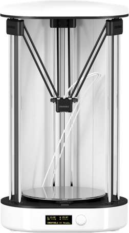

# CREATABLE_D3
The Perfect 3D Printer for Beginners, Educators and Experts.
[creatablelabs.com](http://creatablelabs.com/)

#### Folder Description
 - Hardware : Mainboard, OLED board, Heat bed circuit board and PCB file (The mainboard is working with Allegro of Cadence and the rest is working with Eagle CAD)
 - Firmware : Mainboard firmware [Download](https://github.com/AteamVentures/CREATABLE_D3/raw/master/Firmware/D3_Firmware.zip)  
	1. Connect the printer and computer with the USB cable.
	2. Unzip the file you received from the link above.
	3. Run Cue and execute Machine> Install Custom Firmware ... from the main menu.
	4. Select the hex file from step 2 and click Open.
	5. Wait for uploading to finish.
	6. After completing the upload, operate the printer's menu to execute INFO / SETTINGS> RESTORE DEFAULT.
	7. Execute the leveling and filament insertion according to the first run instructions. If you have already done so, continue to press the button without further action.
	8. Execute INFO / SETTINGS> FIRMWARE VERSION to check the version information.

 - stk500v2 : This it the ATmega2560 bootloader of main board.

#### Cura CREATABLE Edition

- To use the printer, a slicing process is required to convert model files (stl, obj, etc.) to Gcode. To do this, we offer Cura CREATABLE Edition, a slicing software.
- Information on the Cura CREATABLE Edition can be found at the following link.
- [Cura CREATABLE Edition](https://github.com/AteamVentures/CuraCreatableEdition)

#### Folder Description
 -  Hardware: Mainboard, OLED board, Heat bed circuit board and PCB file (The mainboard is working with Cadence's Allegro and the rest with Eagle CAD)
 - Firmware : Mainboard firmware [Download](https://github.com/AteamVentures/CREATABLE_D3/raw/master/Firmware/D3_Firmware.zip)  
	#### How to update firmare
	1. Connect the printer and computer with a USB cable.
	2. Unzip the file you received from the link above.
	3. Execute Cura and run Machine> Install Custom Firmware ... from the main menu.
	4. Select the hex file from step 2 and click "Open".
	5. Wait for uploading to finish.
	6. After completing the upload, operate the printer's menu to execute INFO / SETTINGS> RESTORE DEFAULT.
	7. Execute leveling and filament insertion according to "First run" instructions. If you have already done so, continue to press the button without further action.
	8. Execute INFO / SETTINGS> FIRMWARE VERSION to check the version information.
	- stk500v2 : 메인 보드 ATmega2560 bootloader

#### Differences from Creatable D2 in H/W

- Using Silab's CP2104 for USB connection
- Motor driver A4988 is onboard.
- OLED board: Integrate 2 boards into one board
- Heat bed: Adjusts the resistance value so that it is heated quickly.

#### Cura CREATABLE Edition

- Cura CREATABLE Edition에 대한 정보는 다음 링크에서 확인가능하다.
- To use the printer, a slicing process is required to convert model files (stl, obj, etc.) into Gcode. To do this, we offer Cura CREATABLE Edition (Cutomized Cura).
- Information about the Cura CREATABLE Edition can be found at the following link.
- [Cura CREATABLE Edition Link](https://github.com/AteamVentures/CuraCreatableEdition)
